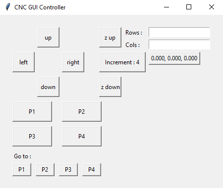

## CNC Spectrophotometer Interfacing

This project needs serveral hardware components
- 3018-PRO CNC Router Machine (a usb cable & power source are provided)
- CM700d Spectrophotometer (a usb cable & power source are provided)
- 1 1/4-in x 3-1/2-in threaded bolt
- 1 1-1/4-in rubber washer
- 1 1/2-in rubber washer
- a 3d printed mount
- a method to secure the printed cards to the bed of the CNC

This project runs python, and its python has been tested in a python 3.12 enviornment. Please make sure to have the following libraries.
- Tkinter (for gui uses)
- Serial (for serial connection to CNC)
- Time (included by default, for pauses)
- numpy (for math)
To install all the libraries, locate your python enviornment with pip, open a command line, then type 
`py -m pip install tk serial numpy`  

## CNC Spectrophotometer Mount
Using [the file provided](./hardware/cnc%20konica%20minolta%20mount.stl), you can print the mount for use with the CNC. This mount requires one 1/4-in x 3-1/2-in bolt, and two washers.

